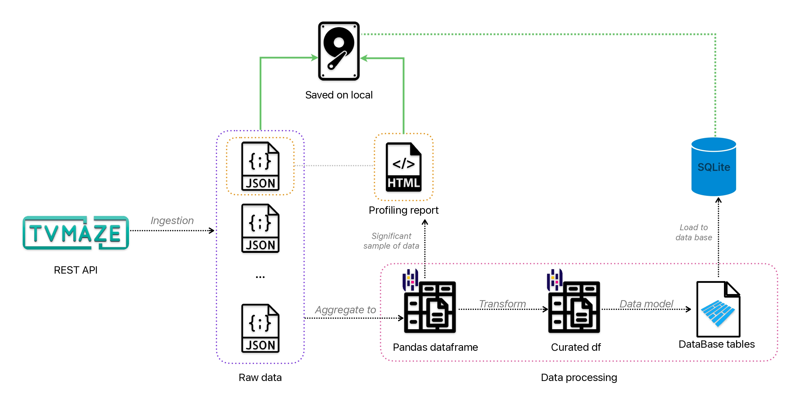
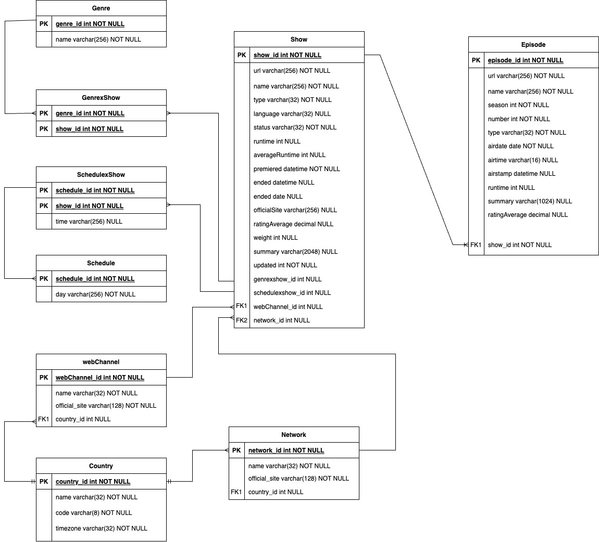

# datapipeline tvseries

Development of a short project to ETL from a REST API to a SQLite database

data ingestion is modeled as follows. Please check it out for better understanding of the code.



The data model designed for the project is the following


To install this project you can follow the following steps:
-- previous requierements:
make sure you have already installed python and its version is the same or higher than mine:

```text
Python 3.9.6
```

also consider the need for having installed git on your system

```text
git version 2.39.2
```

## ⚙️ INSTALLING STEPS

1. copy the current repository into your system with

    ```bash
    git clone https://github.com/fsosap/datapipeline-tvseries.git
    ```

2. create a virtual environment to run the project and avoid downloads on your global python environment

    ```bash
    python -m venv <venv_name>
    ```

3. activate your virtual environment so you can start downloading packages

    ```bash
    # for UNIX based systems
    source <venv_name>/bin/activate

    # for windows users
    C:\> <venv_name>\Scripts\activate.bat
    ```

4. download the dependencies from 'requirements.txt' file with the following command

    ```bash
    pip install -r requirements.txt
    ```

5. run the code with

    ```bash
    python src/main.py
    ```

## 🐋 Docker support

This project supports running in a Docker container for easy deployment and isolation. Follow the steps below to run the project using Docker.

### Prerequisites

Before you begin, make sure you have Docker and Docker Compose installed on your system.

- [Docker Installation Guide](https://docs.docker.com/get-docker/)
- [Docker Compose Installation Guide](https://docs.docker.com/compose/install/)

### Docker Configuration

1. Clone the current repository into your system:

    ```bash
    git clone https://github.com/fsosap/datapipeline-tvseries.git
    ```

2. Navigate to the project directory:

    ```bash
    cd datapipeline-tvseries
    ```

3. Build and run the project using Docker Compose:

```bash
docker-compose up --build
# Or use
docker compose up --build
```

Docker Compose will create a Docker container for your project and mount volumes for data storage and the SQLite database.

### Managing Data

- Downloaded data files will be stored in the `data/` directory within the project.
- The SQLite database will be stored in the `db/` directory within the project.

By using volumes, data and database changes will persist even if the Docker container is stopped or removed.

### Additional Configuration

Make sure that your project code correctly references the paths within the container for data storage and database operations as defined in the `Dockerfile` and `docker-compose.yml` files.

Feel free to customize the `.dockerignore` file to exclude any project-specific files or directories you don't want to include in the Docker image.

For more information on Docker and Docker Compose, refer to the official documentation:

- [Docker Documentation](https://docs.docker.com/)
- [Docker Compose Documentation](https://docs.docker.com/compose/)